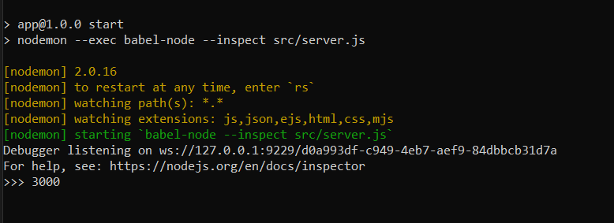

Các bước cài đặt app trên localhost sau khi repository được clone:

B1: Cài đặt môi trường Nodejs v16.13.2.

B2: Sử dụng XAMPP tạo môi trường hosting trên máy tính -> tạo database có tên là quanlysangkien -> import file CSDL.sql vào quanlysangkien.

B3: Tại folder repository vừa clone (App) sử dụng Command Prompt thực hiện lệnh "npm install" để khởi tạo và cài đặt các package cần thiết.

B4: Sau khi hoàn thành cài đặt các package -> thực hiện lệnh "npm start" để khởi chạy

khi xuất hiện dòng thông báo ">>> 3000" tức là đã khởi chạy app thành công trên port 3000.

http://localhost:3000/

- file csdl và file mẫu import danh sách nhân viên trong folder CSDL.
- các báo cáo sáng kiến do nhân viên upload lên sẽ lưu trong folder src/files.
